# Takım İsmi

# 👥 Takım 102

# Takım Üyelerimiz

| Fotoğraf | İsim | Rol | LinkedIn Hesabı | GitHub Hesabı |
| :---: | :--- | :--- | :--- | :--- |
|  | Eylül Kalfa | Product Owner & Developer | [linkedin.com/in/eylulkalfa](https://www.linkedin.com/in/eylulkalfa/) | <a href="https://github.com/eylulkalfa"> github.com/eylulkalfa</a> |
|  | Esra Eda Kılıç | Scrum Master & Developer | [linkedin.com/in/esraedakilic](https://www.linkedin.com/in/esraedakilic/) | <a href="https://github.com/edakilicc"> github.com/edakilicc</a> |
|  | Yiğit Emre Demiral | Developer | [linkedin.com/in/yiğitemredemiral](https://www.linkedin.com/in/yi%C4%9Fitemredemiral/) | <a href="https://github.com/emre-5"> github.com/emre-5</a> |
|  | Serhat Erdoğan | Developer | [linkedin.com/in/serhat-erdogann](https://www.linkedin.com/in/serhat-erdogann/) | <a href="https://github.com/SerhatErdogann"> github.com/SerhatErdogann</a> |

# Ürün İsmi

# 💊 PharmaGuard

### AI-Powered Smart Medication & Treatment Management Platform
 

# Ürün Açıklaması
**PharmaGuard**, kullanıcıların ilaç kullanım süreçlerini daha güvenli, düzenli ve kolay yönetmelerini sağlayan yapay zekâ destekli bir ilaç ve tedavi yönetim platformudur. 
Uygulama; ilaçların manuel olarak eklenmesini, reçete fotoğraflarından OCR teknolojisi ile ilaç bilgilerinin okunmasını, günlük ilaç takibinin yapılmasını ve yapay zekâ tarafından prospektüs bilgilerinin sade bir dille özetlenmesini sağlar. 
Ayrıca kullanıcılar, ilaç kullanım geçmişlerini takip edebilir ve doktor kontrolleri öncesinde haftalık tedavi raporlarını PDF formatında oluşturabilir.

# Ürünün Amacı
**PharmaGuard**, kronik hastalar, yaşlı bireyler ve düzenli ilaç kullanan kişilerin ilaç kullanım süreçlerini daha güvenli, düzenli ve takip edilebilir hale getirmeyi amaçlamaktadır. Kullanıcıların ilaçlarını zamanında kullanmalarını desteklerken, reçete ve prospektüs bilgilerinin anlaşılmasını kolaylaştırır ve yapay zekâ destekli analizlerle tedavi sürecini daha verimli yönetmelerine yardımcı olur. Ayrıca doktor kontrolleri öncesinde düzenli tedavi raporları oluşturarak hasta ve sağlık profesyonelleri arasındaki iletişimi güçlendirmeyi hedefler.

# Ürünün Özellikleri
* **Manuel İlaç Yönetimi:** Kullanıcılar ilaçlarını kolayca sisteme ekleyebilir, düzenleyebilir ve günlük kullanım planlarını oluşturabilir.

* **OCR Destekli Reçete Okuma:** Reçete fotoğrafları Tesseract OCR teknolojisi ile analiz edilerek ilaç isimleri otomatik olarak sisteme aktarılır.

* **Yapay Zekâ Destekli Prospektüs Özeti:** Gemini API ile ilaç prospektüsleri sade ve anlaşılır bir dille özetlenerek kullanıcıların ilaçlarını daha bilinçli kullanmaları desteklenir.

* **Günlük İlaç Takibi:** Kullanıcılar ilaçlarını alındı/alınmadı olarak işaretleyebilir ve günlük tedavi süreçlerini düzenli şekilde takip edebilir.

* **Akıllı İlaç Analizi:** Aynı etken maddeye sahip ilaçlar tespit edilerek kullanıcıya bilgilendirici uyarılar sunulur.

* **Haftalık Tedavi Raporu:** Kullanıcının ilaç kullanım geçmişi analiz edilerek doktor kontrollerinde kullanılabilecek PDF formatında haftalık rapor oluşturulur.

* **Kullanıcı Dostu Dashboard:** İlaç kullanım oranı, günlük görevler ve tedavi süreci tek bir ekranda görselleştirilerek kullanıcıya sunulur.

# Hedef Kitle
* Kronik hastalığı nedeniyle düzenli ilaç kullanan bireyler
* Birden fazla ilaç kullanan kullanıcılar
* Yaşlı bireyler ve bakımını üstlenen yakınları
* Düzenli tedavi süreci gerektiren hastalar
* İlaç kullanımını düzenli takip etmek isteyen herkes

# Kullanılacak Teknolojiler
* Frontend: React.js, Tailwind CSS
* Backend: FastAPI
* Veritabanı: PostgreSQL
* Yapay Zekâ: Gemini API
* OCR (Optik Karakter Tanıma): Tesseract OCR
* PDF Oluşturma: ReportLab
* API Testi: Postman
* Sürüm Kontrolü: Git & GitHub
* Dağıtım (Deployment): Vercel (Frontend), Render (Backend)

# Product Backlog 
Proje planlama, görev takibi ve sprint yönetimi süreçlerimizi Trello üzerinden yürütmekteyiz.

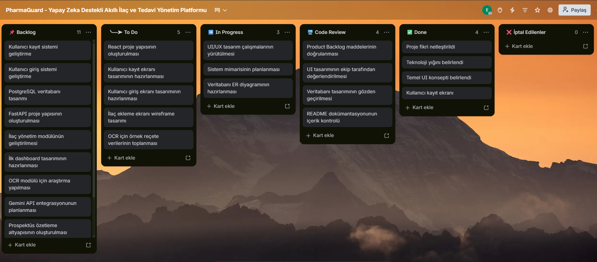

---
# Sprint Süreci

  
<h2>Sprint 1</h2>

## Sprint Notları
- Ekip üyeleri tanışarak ilk toplantı gerçekleştirildi.
- Scrum rolleri (Product Owner, Scrum Master ve Developer) belirlendi.
- Farklı proje fikirleri ekip içerisinde değerlendirildi ve avantaj/dezavantaj analizleri yapıldı.
- Yapılan değerlendirmeler sonucunda **PharmaGuard** projesinin geliştirilmesine karar verildi.
- Projenin amacı, hedef kitlesi ve temel özellikleri netleştirildi.
- MVP kapsamında geliştirilecek özellikler belirlendi.
- Kullanılacak teknolojiler (React, FastAPI, PostgreSQL, Gemini API, Tesseract OCR vb.) üzerine araştırmalar yapıldı ve ekip içerisinde fikir alışverişinde bulunuldu.
- GitHub reposu oluşturuldu ve README dokümantasyonu hazırlanmaya başlandı.
- Product Backlog oluşturuldu ve Sprint 2 için geliştirme yol haritası planlandı.

---
## 🗣 Daily Scrum

Sprint 1 süresince ekip içi iletişim ve sprint koordinasyonu **Zoom** ve **Slack** üzerinden yürütülmüştür.

Toplantılar ve yazılı iletişim sürecinde ekip üyeleri tarafından:

- Tamamlanan çalışmalar,
- Bir sonraki adımlar ve planlanan görevler,
- Karşılaşılan sorunlar ve ihtiyaç duyulan destekler,
- Proje kapsamına ilişkin fikir ve öneriler

ekip ile paylaşılmış ve sprint süreci ortak iletişim kanalları üzerinden takip edilmiştir.

🗂 **Toplantı notları ve iletişim kayıtları:**  
📄 [DailyScrumMeets.pdf](Documentation/Sprint1/DailyScrumMeets.pdf)

---

##  Sprint Board

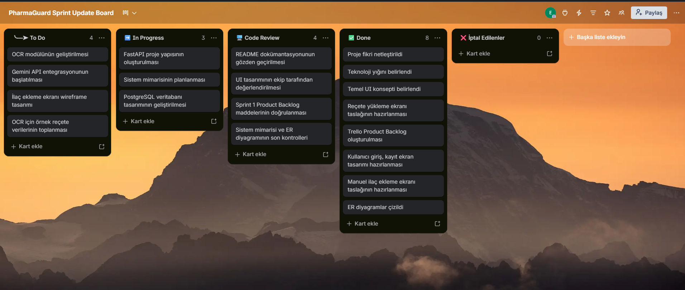

---

## Ürün Durumu (Ekran Görüntüleri)

Sprint 1 kapsamında uygulamanın temel kullanıcı arayüzü (UI) taslakları hazırlanmıştır. Bu ekranlar, ürünün temel akışını ve planlanan özelliklerini göstermek amacıyla oluşturulmuş ön tasarımlardır. Sprint 2 sürecinde ekip tarafından tekrar değerlendirilerek kullanıcı deneyimi (UX), görsel tasarım ve fonksiyonellik açısından gerekli iyileştirmeler gerçekleştirilecektir.

| Ürün Taslağı 1 | Ürün Taslağı 2 | Ürün Taslağı 3 | Ürün Taslağı 4 |
| :------------: | :------------: | :------------: | :------------: |
| 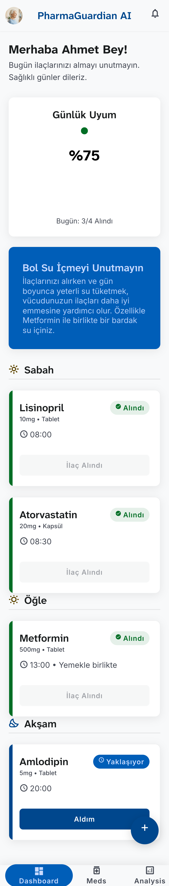 | 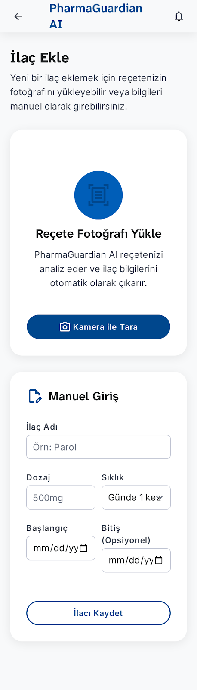 | 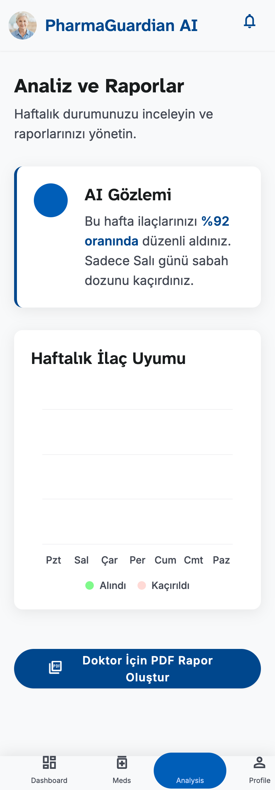 | 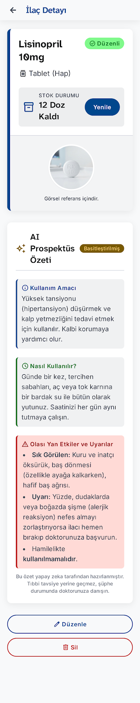 |
---

##  Sprint Review

Sprint 1 sonunda gerçekleştirilen toplantılar doğrultusunda proje fikri netleştirilmiş ve **PharmaGuard** projesinin geliştirilmesine karar verilmiştir. 
Projenin kapsamı, hedef kitlesi ve MVP özellikleri ekip tarafından değerlendirilmiş, kullanılacak teknolojiler üzerinde ortak bir görüş oluşturulmuştur.
Sprint sürecinde GitHub reposu oluşturulmuş, proje dokümantasyonuna başlanmış ve Product Backlog hazırlanmıştır.
Bir sonraki sprintte gerçekleştirilecek geliştirme görevleri planlanmış ve ekip üyeleri arasında ön görev dağılımı yapılmıştır.

## Sprint Retrospective

### Sprint Boyunca İyi Gidenler

- Ekip içerisinde fikir paylaşımı açık ve yapıcı bir şekilde gerçekleşti.
- Farklı proje fikirleri detaylı olarak değerlendirilerek ortak bir karara varıldı.
- Görevler ekip üyelerinin ilgi alanları ve istekleri doğrultusunda planlandı.
- İletişim sürecinde ekip üyeleri birbirlerine destekleyici ve anlayışlı bir yaklaşım sergiledi.

### Bir Sonraki Sprintte Daha İyi Yapabileceklerimiz

- Ortak toplantı saatlerini daha erken planlayarak tüm ekip üyelerinin katılımını artırmayı hedefliyoruz.
- Zaman yönetimini daha verimli hale getirmek için görevlerin takibini daha düzenli sürdüreceğiz.
- Sprint süresince görev ilerlemelerini daha sık paylaşarak ekip içi koordinasyonu güçlendireceğiz.
- Geliştirme sürecine daha erken başlayarak Sprint hedeflerini planlanan takvime uygun şekilde ilerleteceğiz.

  
<h2>Sprint 2</h2>

 
## Sprint Notları

- Sprint 1 sonunda belirlenen proje kapsamı ve MVP özellikleri yeniden değerlendirilerek Sprint 2 hedefleri netleştirildi.
- Sprint 2’nin temel hedefi, Sprint 1’de hazırlanan kullanıcı arayüzü taslaklarının işlevsel bir uygulamaya dönüştürülmesi ve projenin temel teknik altyapısının oluşturulması olarak belirlendi.
- Uygulamanın frontend tarafı **React, Vite ve Tailwind CSS** teknolojileri kullanılarak geliştirildi.
- Backend altyapısı **FastAPI** kullanılarak oluşturuldu ve frontend ile API bağlantısı sağlandı.
- Kullanıcıların hesap oluşturabilmesi, giriş yapabilmesi ve kişisel verilerine güvenli şekilde erişebilmesi amacıyla **JWT tabanlı kullanıcı kayıt ve giriş sistemi** geliştirildi.
- Kullanıcıların ilaçlarını ekleyebilmesi, görüntüleyebilmesi, güncelleyebilmesi ve silebilmesi için ilaç yönetim işlemleri uygulamaya entegre edildi.
- İlaç kullanım saatlerinin kaydedilmesi ve günlük ilaç programının oluşturulması sağlandı.
- Kullanıcıların ilaçlarını alıp almadıklarını işaretleyebilecekleri günlük ilaç takip sistemi geliştirildi.
- Günlük kullanım kayıtlarına göre haftalık tedavi uyum verilerinin hesaplanması ve rapor ekranında görüntülenmesi sağlandı.
- Yaygın kullanılan ilaçlara ait temel bilgilerin tutulabilmesi amacıyla referans ilaç veritabanının ilk sürümü oluşturuldu.
- Reçete ve ilaç kutusu görsellerinden ilaç bilgilerinin okunabilmesi için **Tesseract OCR** ve **Gemini Vision** destekli görüntü analiz altyapısı geliştirildi.
- **Gemini API** kullanılarak ilaç prospektüslerinin kullanıcı dostu bir dille özetlenmesi ve ilaç etkileşimlerinin analiz edilmesi için gerekli servisler oluşturuldu.
- Uygulamanın Android cihazlarda çalışabilmesi için **Capacitor** entegrasyonu gerçekleştirildi ve ilaç saatlerine yönelik yerel bildirim altyapısı hazırlandı.
- Uygulamaya Türkçe ve İngilizce dil seçenekleri ile açık/koyu tema desteği eklendi.
- Sprint sonunda geliştirilen özellikler ekip tarafından incelendi; test, hata düzeltme, OCR doğruluğunun artırılması ve canlıya alma çalışmaları bir sonraki sprint için planlandı.

---

## 🗣 Daily Scrum

Sprint 2 süresince ekip içi iletişim ve geliştirme sürecinin koordinasyonu **Zoom** ve **Slack** üzerinden yürütülmüştür.

Daily Scrum görüşmelerinde ekip üyeleri tarafından:

- Frontend ve backend geliştirmelerinde tamamlanan çalışmalar,
- Kullanıcı ve ilaç yönetimi özelliklerinin ilerleme durumu,
- OCR ve yapay zekâ entegrasyonu üzerine yapılan çalışmalar,
- Karşılaşılan teknik sorunlar ve geliştirilen çözüm önerileri,
- Test edilmesi gereken özellikler ve bir sonraki geliştirme adımları

ekip ile paylaşılmıştır. Görevlerin ilerleme durumları düzenli olarak değerlendirilmiş ve sprint hedefleri doğrultusunda ekip içi koordinasyon sürdürülmüştür.

🗂 **Toplantı notları ve iletişim kayıtları:**  
📄 [Sprint 2 Daily Scrum](Documentation/Sprint2/DailyScrumMeets2.pdf)

---

##  Sprint Board

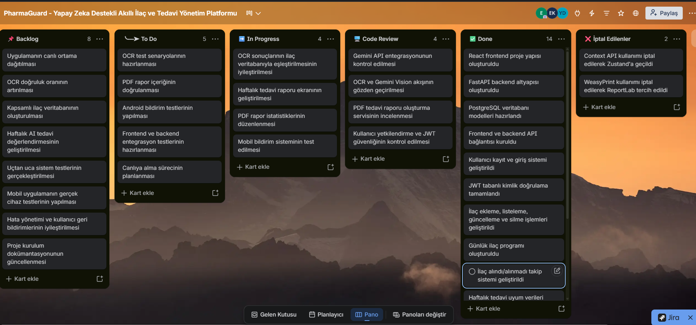

---

## Ürün Durumu (Ekran Görüntüleri)

Sprint 2 kapsamında, Sprint 1’de hazırlanan kullanıcı arayüzü taslakları geliştirilerek uygulamanın temel özellikleri işlevsel hâle getirilmiştir. Frontend ve backend bağlantısı kurulmuş, kullanıcı ve ilaç yönetimi başta olmak üzere projenin temel uygulama akışları oluşturulmuştur.

Aşağıdaki ekran görüntüleri, Sprint 2 sonunda ürünün ulaştığı mevcut geliştirme durumunu göstermektedir.

| Ürün Görseli 1 | Ürün Görseli 2 | Ürün Görseli 3 | Ürün Görseli 4 |
| :------------: | :------------: | :------------: | :------------: |
|  | 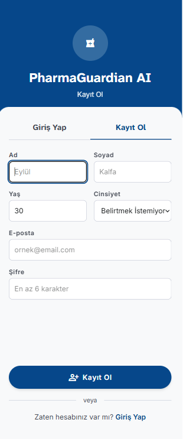 | 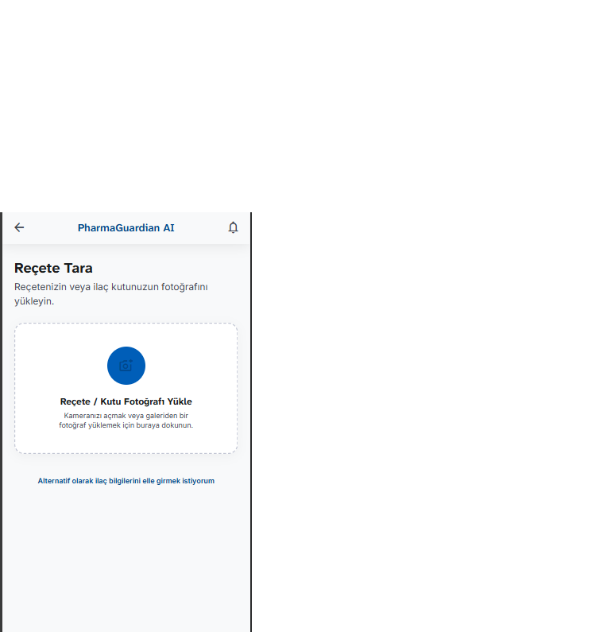 | 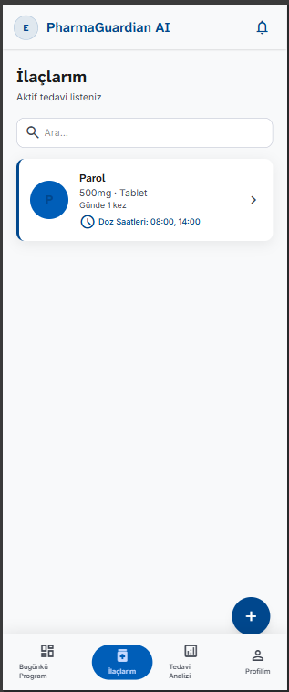 |

 

| Ürün Görseli 5 İlaç Ekledikten Sonra | Ürün Görseli 6 | Ürün Görseli 7 | Ürün Görseli 8 |
| :------------: | :------------: | :------------: | :------------: |
| 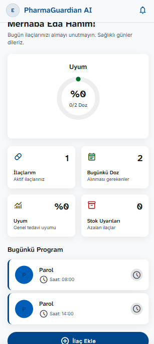 | 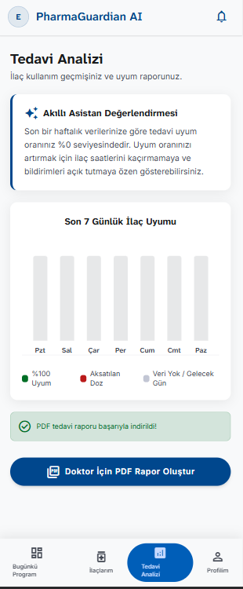 | 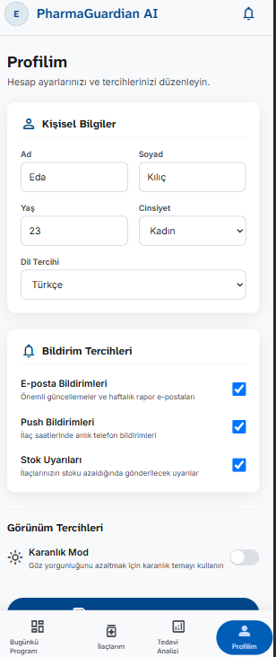 | 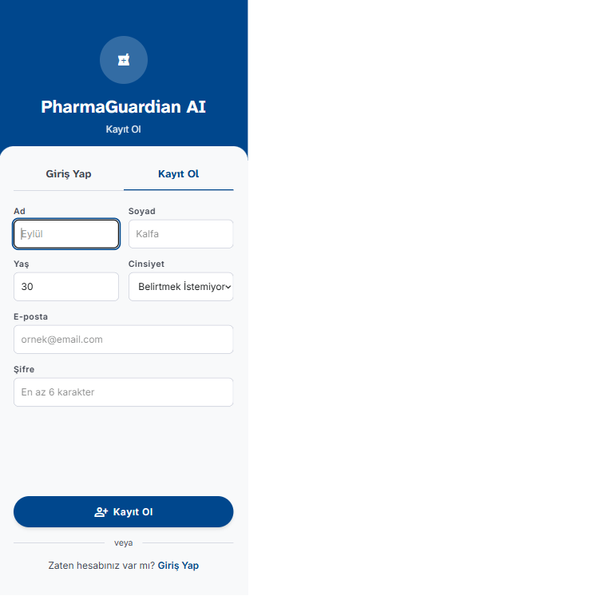 |

---

## Sprint Review

Sprint 2 sonunda gerçekleştirilen toplantıda sprint boyunca geliştirilen özellikler ekip tarafından değerlendirilmiştir. Sprint 1’de hazırlanan kullanıcı arayüzü taslakları geliştirilerek işlevsel uygulama ekranlarına dönüştürülmüş, React tabanlı frontend ve FastAPI tabanlı backend yapısı oluşturulmuştur.

Kullanıcı kayıt ve giriş sistemi, ilaç yönetimi, günlük ilaç takibi ve haftalık tedavi uyumu gibi temel özellikler uygulamaya entegre edilmiştir. Ayrıca OCR ile reçete tarama, Gemini API ile prospektüs özetleme ve ilaç etkileşim analizi özelliklerinin altyapısı geliştirilmiştir.

Sprint sonunda projenin önemli bir bölümünde ilerleme kaydedilmiş; test, hata düzeltme, OCR doğruluğunun artırılması, mobil bildirimlerin kontrol edilmesi ve canlıya alma çalışmaları bir sonraki sprint için planlanmıştır.

## Sprint Retrospective

### Sprint Boyunca İyi Gidenler

- Sprint 1’de hazırlanan tasarımlar işlevsel uygulama ekranlarına dönüştürüldü.
- Frontend, backend ve veritabanı geliştirmelerinde önemli ilerleme kaydedildi.
- Kullanıcı yönetimi, ilaç takibi, OCR ve yapay zekâ özelliklerinin temel altyapıları oluşturuldu.
- Karşılaşılan teknik sorunlar ekip içerisinde değerlendirilerek çözüm önerileri geliştirildi.
- Ekip içi iletişim sürdürülerek projenin geliştirme süreci takip edildi.

### Bir Sonraki Sprintte Daha İyi Yapabileceklerimiz

- Geliştirme görevlerini ekip üyeleri arasında daha dengeli dağıtmayı hedefliyoruz.
- Her ekip üyesinin kod geliştirme, test ve entegrasyon süreçlerinde daha aktif sorumluluk almasını sağlayacağız.
- Kodlama sürecinin belirli ekip üyeleri üzerinde yoğunlaşmaması için görevleri daha küçük ve takip edilebilir parçalara ayıracağız.
- Görev ilerlemelerini daha düzenli paylaşarak ekip içi koordinasyonu güçlendireceğiz.
- Geliştirilen özellikleri sprint süresince düzenli olarak test ederek hata düzeltmelerini son aşamaya bırakmayacağız.
